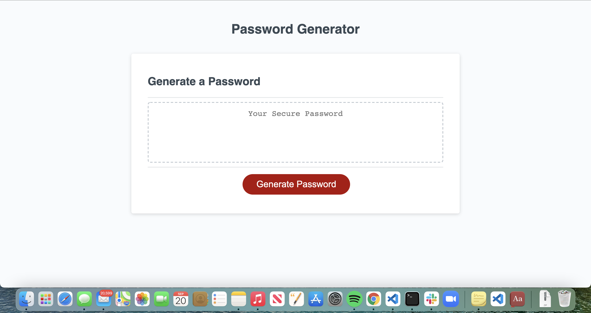

# Random Password Generator

##
Generate a random password. While on the webpage have window prompts and confirms to ask users:
-how long they would like their password to be (between 8-128 characters)
-Include special characters
-include numbers
-include upper case letters
-include lower case letters

The program then creates a randomized password based on the user inputs. 
if user inputs a string for length, a window confirm will pop up telling the to input a number value, and has user press generate password to restart the cycle. 
if the user adds a length less than 8 or longer than 128 an alert window pops up telling user to enter a value between 8-128 and press generate password to restart file. 
Password is generated, and generate password can be clicked to restart the prompts.

** I have a small commit history because my git lab got messed up and I had to create a whole new repo**

screenshot of webpage

link to deployed page
https://emilyelizabethdaniel.github.io/randomPassword/